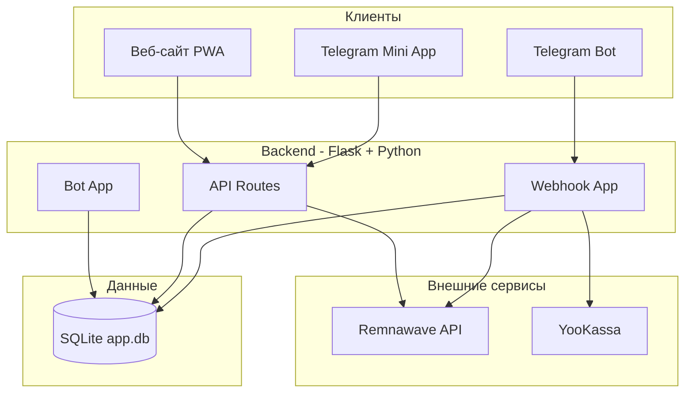

# Daralla VPN — целевое техническое описание (финальное состояние)

Документ описывает, каким должен стать продукт в завершённой стадии: ожидаемое поведение, граничные случаи и критерии готовности по каждому блоку.

## 1. Продукт и границы ответственности

**Daralla VPN** — платформа продажи VPN-подписок с двумя точками входа:

- **Telegram Mini App** — основной интерфейс: подписка, оплата, карта серверов
- **Веб-сайт (PWA)** — вход по логину/паролю, регистрация, привязка Telegram

**В зоне ответственности:**

- Регистрация, вход, привязка аккаунтов
- Покупка и продление подписок через YooKassa
- Интеграция с Remnawave (единственный источник подписок)
- Карта серверов (декоративные маркеры), события, админка

**Вне зоны ответственности:**

- X-UI, прямое управление VPN-серверами
- Пробные периоды

---

## 2. Архитектура




---

## 3. Критерии готовности по подсистемам

### 3.1 Регистрация и аутентификация


| Сценарий                        | Ожидаемое поведение                                                                     | Готово, когда                                              |
| ------------------------------- | --------------------------------------------------------------------------------------- | ---------------------------------------------------------- |
| Telegram: первый /start         | Создаётся account + identity(telegram), показ приветствия и кнопки «Открыть приложение» | Пользователь попадает в Mini App без повторной регистрации |
| Веб: регистрация                | POST /api/auth/register — создаётся account + identity(password)                        | Можно войти по логину/паролю                               |
| Веб: вход                       | POST /api/auth/login — токен/session                                                    | Mini App и веб работают с одним аккаунтом                  |
| Привязка Telegram               | «Привязать» на сайте — state — /start link_X — link_identity                            | Веб-аккаунт получает Telegram, уведомления в чат           |
| Конфликт: Telegram уже привязан | Подтверждение «отвязать и привязать»                                                    | Пользователь понимает последствия                          |


**Идеальное состояние:** два пути (Telegram / веб) сходятся к одному account; identities не дублируются.

### 3.2 Покупка и продление подписки


| Сценарий             | Ожидаемое поведение                                            | Готово, когда                                               |
| -------------------- | -------------------------------------------------------------- | ----------------------------------------------------------- |
| Создание платежа     | Выбор тарифа — YooKassa payment — ссылка                       | Пользователь видит «Оплатить», переход на YooKassa          |
| Успешная оплата      | Webhook succeeded — Remnawave create/update — subscription URL | В Telegram ссылка на подписку, платёж succeeded + activated |
| Продление            | Существующий Remnawave user — extend                           | expireAt обновляется                                        |
| Повторный webhook    | Идемпотентность: succeeded + activated — skip                  | Нет дублей                                                  |
| Отмена/возврат       | Webhook canceled/refunded — статус в БД                        | Данные консистентны                                         |
| Remnawave недоступен | Ошибка — платёж failed, логирование                            | Возможность повторить вручную                               |


**Идеальное состояние:** каждый успешный платёж однозначно приводит к подписке в Remnawave; все webhook-сценарии обработаны.

### 3.3 Карта серверов


| Элемент               | Ожидаемое поведение                      | Готово, когда                      |
| --------------------- | ---------------------------------------- | ---------------------------------- |
| Отображение           | Маркеры по lat/lng, подпись display_name | Карта загружается                  |
| Админ: добавление     | Модалка: название, широта, долгота       | Маркер появляется после сохранения |
| Админ: редактирование | Те же поля                               | Изменения видны                    |
| API                   | /api/servers, /api/user/server-usage     | Mini App и веб получают данные     |


**Идеальное состояние:** маркеры — декорация; источник — server_manager; админка без лишних полей.

### 3.4 Админ-панель


| Раздел            | Ожидаемое поведение                         | Готово, когда                    |
| ----------------- | ------------------------------------------- | -------------------------------- |
| Доступ            | Только ADMIN_IDS                            | Неавторизованный не видит данные |
| Пользователи      | Поиск, карточка: аккаунт, подписки, платежи | Можно найти и понять статус      |
| Создание подписки | Ручной ввод дней — Remnawave create/update  | Подписка без оплаты              |
| Маркеры           | CRUD маркеров                               | Список редактируется             |
| Рассылка          | Текст — всем с identity(telegram)           | Сообщение доходит                |
| События           | CRUD событий, награды 1–3 место             | Рейтинг считается                |


**Идеальное состояние:** админ решает типичные задачи без обходных путей.

### 3.5 Модуль событий


| Сценарий          | Ожидаемое поведение                                   | Готово, когда       |
| ----------------- | ----------------------------------------------------- | ------------------- |
| Создание          | Название, описание, даты, награды                     | Событие в списке    |
| Реферальная связь | Оплата приглашённого — +1 рефереру в активные события | Рейтинг обновляется |
| Рейтинг           | Сортировка по оплатам приглашённых                    | Админ видит топ     |
| Награды           | Ручная выдача (продление и т.п.)                      | Процесс понятен     |


**Идеальное состояние:** модуль включён; события и рейтинг работают; награды — ручные, но прозрачные.

### 3.6 Уведомления


| Сценарий            | Ожидаемое поведение                             | Готово, когда            |
| ------------------- | ----------------------------------------------- | ------------------------ |
| Истекающая подписка | Периодическая проверка — уведомление в Telegram | Напоминание до истечения |


**Идеальное состояние:** уведомления доставляются стабильно; дубликаты не отправляются.

---

## 4. Контракты API (целевые)

**Публичные (без auth):** `GET /api/servers`, `POST /api/auth/login`, `POST /api/auth/register`

**Пользовательские (auth):** `GET /api/user/subscriptions`, `GET /api/user/server-usage`, `POST /api/user/payment/create`

**Админ (auth + ADMIN_IDS):** stats, servers-config, users, broadcast, events, subscription

**Идеальное состояние:** endpoints задокументированы; коды ошибок единообразны; CORS настроен.

---

## 5. Интеграции (целевое поведение)


| Сервис        | Ожидание                                                  | Готово, когда                           |
| ------------- | --------------------------------------------------------- | --------------------------------------- |
| **Remnawave** | Login/JWT или API token; create, extend, subscription URL | Все операции подписок проходят          |
| **YooKassa**  | Webhook succeeded/canceled/refunded                       | Все статусы обработаны, идемпотентность |
| **Telegram**  | Webhook, Mini App initData, send_message                  | Бот отвечает, уведомления доходят       |


---

## 6. Конфигурация и деплой

**Обязательно:** `TELEGRAM_TOKEN`, `ADMIN_IDS`, `YOOKASSA_*`, `WEBHOOK_URL`, Remnawave credentials

**Идеальное состояние:** старт по `docker-compose up`; переменные проверяются при запуске; логи в файл и stdout.

---

## 7. Исключённое из продукта

- Пробный период — упоминания удалены
- Группы серверов — только плоский список маркеров
- Аналитика (графики, нагрузка) — не входит
- X-UI, sync-flow — удалены

---

## 8. Критерий «финальная стадия»

Продукт считается завершённым, когда:

1. Все сценарии из раздела 3 проходят без ошибок
2. Контракты API стабильны
3. Интеграции с Remnawave, YooKassa, Telegram работают в продакшене
4. Админ-панель покрывает перечисленные задачи
5. Исключённый функционал удалён из кода и UI

---

## 9. Файловая структура

```
bot/
├── bot.py              # Точка входа бота
├── config.py           # Конфигурация
├── context.py          # AppContext
├── db/                 # SQLite: accounts, payments, servers_config, notifications, events
├── services/           # RemnawaveClient, SubscriptionService, MultiServerManager
├── handlers/           # commands, webhooks, callbacks
├── events/             # Модуль событий (реферальные конкурсы)
└── webapp/             # Mini App + PWA (HTML, JS, CSS)
```

