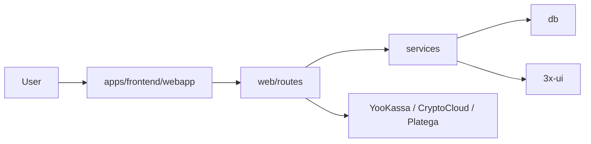

<p align="center">
  
  
  
  
  
</p>

# Daralla VPN

Платформа для продажи и управления VPN-подписками: **Telegram Mini App**, **веб-клиент** и **веб-админка**. От приёма платежей до выдачи доступа — синхронизация клиентов с панелями [3x-ui](https://github.com/MHSanaei/3x-ui) при настроенных интеграциях и окружении.

---

## Возможности

Ниже — то, что реализовано в коде. Реальная доступность сценариев зависит от переменных в `.env`, внешних сервисов и флагов опциональных модулей.

### Клиент

- **Telegram Mini App** — оформление и продление подписок, управление в Telegram
- **Веб-клиент** — одностраничное приложение, вход по логину и паролю; при необходимости единая сессия на нескольких доменах через `AUTH_COOKIE_DOMAIN`
- **Оплата** — **YooKassa** (карты, СБП), **CryptoCloud** (криптовалюты), **Platega** (режим: СБП, карта или крипта — задаётся `PLATEGA_PAYMENT_METHOD`, см. `.env.example`)
- **Ссылка подписки** — `GET /sub/{token}` для VLESS-клиентов

### Инфраструктура и синхронизация

- **Несколько серверов** — группы по локациям; подписка открывает доступ ко всем серверам выбранной группы
- **Связь с 3x-ui** — создание, обновление и удаление клиентов на панелях
- **Очередь outbox** — фоновая обработка задач синхронизации (префикс `DARALLA_SYNC_OUTBOX_`); при необходимости параллельно со старым путём синхронизации
- **Нагрузка** — учёт онлайн по серверам

### Уведомления пользователям

- Правила в админке: событие, задержка, шаблон текста, повторы с лимитом

### Админ-панель

- Сводка и графики, пользователи, подписки, серверы и группы
- Рассылка в Telegram с ограничением частоты
- Правила уведомлений (см. выше) и тестовая отправка
- **Коммерция** — тарифы и лимит устройств по умолчанию, API `GET/POST /api/admin/commerce`

### Модуль событий (опционально)

Включается `EVENTS_MODULE_ENABLED`: реферальные события, коды участников, лидерборд, награды в данных события.

---

## Архитектура



Один процесс: **long polling** бота Telegram и **ASGI-сервер** (Quart, Hypercorn) на порту `WEBHOOK_PORT`. API, вебхуки оплаты и раздача статики фронтенда идут через тот же runtime.

---

## Быстрый старт

### Требования

- Python **3.11+**
- Доступ к HTTP API 3x-ui на VPN-серверах, если нужна выдача ключей

### Установка

```bash
git clone <repo-url> && cd Daralla
python -m venv venv
source venv/bin/activate   # Linux, macOS
# venv\Scripts\activate    # Windows
pip install -r requirements.txt
```

### Переменные окружения

В корне лежит **`.env.example`** — шаблон с комментариями.

| Сценарий | Рабочий `.env` |
|----------|----------------|
| Локальный запуск `python -m daralla_backend` | Файл **`apps/backend/src/.env`** — его подхватывает `python-dotenv` (путь относительно пакета `daralla_backend`) |
| Docker Compose | Файл **в корне репозитория** рядом с `docker-compose.yml` — переменные попадают в контейнер через секцию `environment:` |

У **`docker run --env-file`** путь к файлу произвольный: значения попадают в окружение процесса и не зависят от `load_dotenv`.

Создание файла для локального запуска:

```bash
cp .env.example apps/backend/src/.env
```

**Минимум для бота**

| Переменная | Назначение |
|------------|------------|
| `TELEGRAM_TOKEN` | токен от [@BotFather](https://t.me/BotFather) |
| `ADMIN_ID` | числовой Telegram ID администраторов через запятую; допускается имя `ADMIN_IDS` (см. `bot.py`) |

**Платёжные шлюзы** — настройте тот, который используете; допустимо несколько.

| Шлюз | Переменные | Путь webhook на вашем домене (Daralla) |
|------|------------|----------------------------------------|
| YooKassa | `YOOKASSA_SHOP_ID`, `YOOKASSA_SECRET_KEY`, в кабинете — полный URL из `WEBHOOK_URL` | обычно `…/webhook/yookassa` |
| CryptoCloud | `CRYPTOCLOUD_*` | `POST …/webhook/cryptocloud` (точный URL — в настройках проекта CryptoCloud) |
| Platega | `PLATEGA_MERCHANT_ID`, `PLATEGA_SECRET`, при необходимости остальные `PLATEGA_*` | `POST …/webhook/platega` |

**URL внешнего сервиса**

| Переменная | Назначение |
|------------|------------|
| `WEBAPP_URL` | HTTPS мини-приложения: кнопки в боте, уведомления; если `WEBSITE_URL` пуст — используется как «сайт» в заголовках `/sub` |
| `WEBSITE_URL` | опционально: лендинг (`profile-web-page-url` / `website` в ответе VPN subscription URL `/sub`) |
| `SUPPORT_URL` | поддержка для `/sub` (`support-url`), редирект `/support`; вместе с сайтом/каналом — две разные кнопки. Fallback: `TELEGRAM_URL` (устар.) |
| `TELEGRAM_CHANNEL_URL` | опционально: кнопка «канал/новости» в `/sub` (`profile-web-page-url`), если нет `WEBSITE_URL` / `WEBAPP_URL` |
| `DARALLA_TRAFFIC_BUCKETS_ENABLED` | включает per-node traffic bucket лимиты и hard enforcement (фильтрация нод в `/sub` + outbox-применение на панелях) |
| `DARALLA_TRAFFIC_BUCKETS_SYNC_INTERVAL_SECONDS` | интервал фонового пересчета usage/exhausted для bucket |
| `DARALLA_TRAFFIC_BUCKETS_SYNC_ON_SUB` | опционально пересчитывает usage прямо в запросе `/sub` (дороже, но ближе к real-time) |

<details>
<summary>Остальные группы переменных (сжато)</summary>

| Группа | Примеры |
|--------|---------|
| Порт | `WEBHOOK_PORT` (по умолчанию `5000`) |
| Cookie | `AUTH_COOKIE_DOMAIN` (например `.example.com`) |
| Бренд | `VPN_BRAND_NAME`, `BOT_USERNAME`, `TELEGRAM_CHANNEL_URL`, `SUPPORT_URL` |
| Стартовые цены | `PRICE_MONTH`, `PRICE_3MONTH`; детальные тарифы — в админке **Коммерция** |
| Картинки бота | `IMAGE_MAIN_MENU`, `IMAGE_PAYMENT_SUCCESS`, `IMAGE_PAYMENT_FAILED` |
| HTTP к 3x-ui | `XUI_HTTP_TIMEOUT_*`, `XUI_PANEL_MAX_RETRIES` |
| Синхронизация | `DARALLA_SYNC_INTERVAL_SECONDS`, `DARALLA_CLIENT_CATCHUP_INTERVAL_SECONDS` |
| Outbox | `DARALLA_SYNC_OUTBOX_WRITE_ENABLED`, `DARALLA_SYNC_OUTBOX_WORKER_ENABLED`, остальные `DARALLA_SYNC_OUTBOX_*` |
| Traffic buckets | `DARALLA_TRAFFIC_BUCKETS_ENABLED`, `DARALLA_TRAFFIC_BUCKETS_SYNC_INTERVAL_SECONDS`, `DARALLA_TRAFFIC_BUCKETS_SYNC_ON_SUB` |
| События | `EVENTS_MODULE_ENABLED`, `EVENTS_SUPPORT_URL` |
| Retention | `RETENTION_DRY_RUN`, `PAYMENTS_RETENTION_DAYS`, `DELETED_SUBSCRIPTIONS_RETENTION_DAYS`, `AUTO_DELETE_INACTIVE_USERS_DAYS` и др. — см. `.env.example` |
| Отладка | `NGROK_AUTH_TOKEN` |

Полный список и значения по умолчанию — в **`.env.example`**.

</details>

### Запуск локально

```bash
# Linux, macOS
PYTHONPATH=apps/backend/src python -m daralla_backend

# Windows (PowerShell)
$env:PYTHONPATH="apps/backend/src"; python -m daralla_backend
```

База **SQLite** и логи по умолчанию: **`apps/backend/src/data/`** (файл `daralla.db`, каталог `logs/`).

**Служебные HTTP-маршруты**

- `GET /health` — процесс жив
- `GET /ready` — готовность (БД и контекст)
- `GET /metrics` — JSON со счётчиками запросов и обработки webhooks

---

## Docker

В образе: `PYTHONPATH=/app/apps/backend/src:/app`, порт **5000**.

```bash
docker build -t daralla .
docker run --env-file .env -p 5000:5000 \
  -v daralla_data:/app/apps/backend/src/data \
  daralla
```

Удобнее **Docker Compose**: том `./data` → `/app/apps/backend/src/data`, проверка готовности по `GET /ready`, лимит памяти — в `docker-compose.yml`.

```bash
docker compose up -d
```

Терминацию HTTPS (nginx, Caddy, Traefik и т.п.) размещают перед контейнером.

---

## Структура репозитория

```
Daralla/
├── apps/backend/src/daralla_backend/
│   ├── __main__.py              # точка входа: python -m daralla_backend
│   ├── bot.py                   # бот + веб
│   ├── app_context.py
│   ├── core/                    # startup, retention, фоновые задачи
│   ├── client_flow.py
│   ├── handlers/                # команды и callback в Telegram
│   ├── navigation/
│   ├── services/                # 3x-ui, подписки, sync/outbox, платежи, админка
│   ├── db/                      # SQLite, миграции
│   ├── web/
│   │   ├── app_quart.py
│   │   ├── observability.py
│   │   └── routes/              # API, webhooks, статика SPA
│   ├── events/                  # опциональный модуль событий
│   └── utils/
├── apps/frontend/webapp/
│   ├── index.html, app.js, style.css
│   ├── sw.js, offline.html      # PWA / офлайн-заглушка
│   ├── manifest.json
│   ├── icons/
│   ├── legal/                   # terms, privacy
│   └── js/
│       ├── app/
│       ├── api/
│       ├── auth/
│       ├── features/
│       ├── platform/
│       └── shared/, ui/
├── shared/contracts/            # контракты HTTP и примеры JSON
├── scripts/                     # архитектура, смоук фронта, контракты
├── tests/
├── images/                      # изображения для бота
├── Dockerfile
├── docker-compose.yml
├── requirements.txt
├── .env.example
├── README.md
└── LICENSE
```

Один деплой: API и статика фронтенда с одного процесса (условно **modular monolith**). Проверка модульных границ: `python scripts/check_arch_rules.py`.

---

## Тесты и проверки

```bash
pytest
```

Дополнительные скрипты:

```bash
python scripts/check_arch_rules.py
python scripts/check_frontend_smoke.py
python scripts/check_http_contracts.py
```

Контракты: `shared/contracts/http_contracts_v1.json` и каталог `shared/contracts/examples/`.

Размер «горячих» файлов (для разработки): `python scripts/collect_baseline_metrics.py`.

---

## Технологии

| Область | Стек |
|---------|------|
| Бот | python-telegram-bot 20.7 |
| Веб | Quart, Hypercorn |
| БД | SQLite, aiosqlite |
| HTTP | httpx, requests |
| Оплата | YooKassa SDK; CryptoCloud (проверка JWT); Platega (HTTP API + webhook) |
| Утилиты | python-dotenv, tenacity, PyJWT |

---

## Лицензия

**PolyForm Noncommercial License 1.0.0** — [текст на сайте PolyForm](https://polyformproject.org/licenses/noncommercial/1.0.0/), полный текст в файле [`LICENSE`](LICENSE).

Разрешены некоммерческое использование и изучение; коммерческое использование — только с отдельного разрешения правообладателя.

Строка для уведомлений по лицензии (раздел *Notices*):

`Required Notice: Copyright (c) 2025 thesemeiev`
