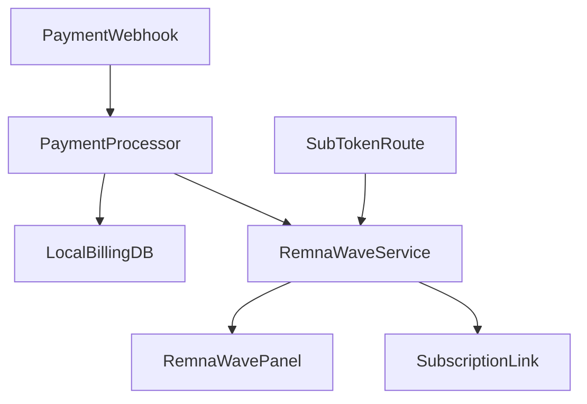

# Daralla VPN (RemnaWave-only)

Daralla — платформа продажи VPN-подписок через Telegram Mini App и web UI.
Текущая production-модель: **single-panel RemnaWave runtime** без 3x-ui и без server-group/sync слоя.

## Архитектура



## Что делает локальная БД

- хранит пользователей, платежи, локальные статусы подписок;
- хранит binding локальной подписки к panel user (`remnawave_bindings`);
- хранит журнал обработанных webhook-событий (`payment_webhook_events`) для идемпотентности.

## Быстрый старт

### Требования

- Python 3.11+
- Доступ к RemnaWave API

### Установка

```bash
git clone <repo-url> && cd Daralla
python -m venv venv
venv/Scripts/activate
pip install -r requirements.txt
```

### Минимальные переменные окружения

| Переменная | Назначение |
|---|---|
| `TELEGRAM_TOKEN` | Telegram bot token |
| `ADMIN_ID` | Telegram ID админов (через запятую) |
| `YOOKASSA_SHOP_ID` | YooKassa shop id |
| `YOOKASSA_SECRET_KEY` | YooKassa secret |
| `WEBHOOK_URL` | Публичный URL backend (для webhook/payment UX) |
| `WEBAPP_URL` | URL Mini App |
| `REMNAWAVE_API_URL` | Base URL RemnaWave API |
| `REMNAWAVE_API_KEY` | API key RemnaWave |

### Webhook hardening (рекомендуется)

| Переменная | Назначение |
|---|---|
| `WEBHOOK_REPLAY_WINDOW_SECONDS` | Допустимое окно timestamp (по умолчанию 300) |
| `YOOKASSA_WEBHOOK_SECRET` | HMAC подпись для `/webhook/yookassa` |
| `CRYPTOCLOUD_WEBHOOK_SECRET` | JWT secret для CryptoCloud |
| `CRYPTOCLOUD_HMAC_SECRET` | Доп. HMAC подпись CryptoCloud webhook |
| `REMNAWAVE_WEBHOOK_SECRET_HEADER` | HMAC подпись для `/webhook/remnawave` |

### Запуск

```bash
python -m bot
```

## Cutover runbook (DB)

Перед миграцией production:

1. Dry-run на копии:
```bash
python scripts/migrate_remnawave_cutover.py --db path/to/copy.db --dry-run
```
2. Apply (скрипт делает backup автоматически):
```bash
python scripts/migrate_remnawave_cutover.py --db data/daralla.db --apply
```
3. Rollback при необходимости:
```bash
python scripts/migrate_remnawave_cutover.py --db data/daralla.db --rollback --backup-file data/daralla.db.cutover.bak
```

## Тесты

```bash
python -m pytest
```

Критичные наборы:

- контракт RemnaWave service;
- платежный flow (new purchase/extend);
- `/sub/{token}` endpoint;
- webhook signature/idempotency checks.
