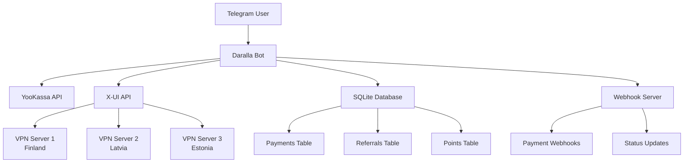
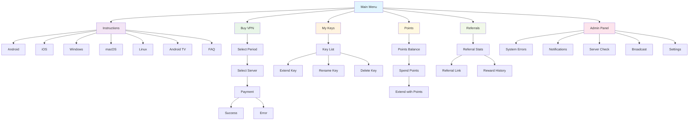
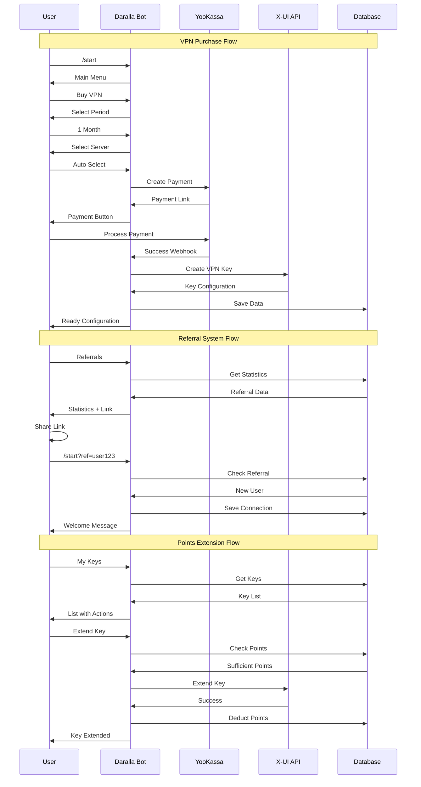
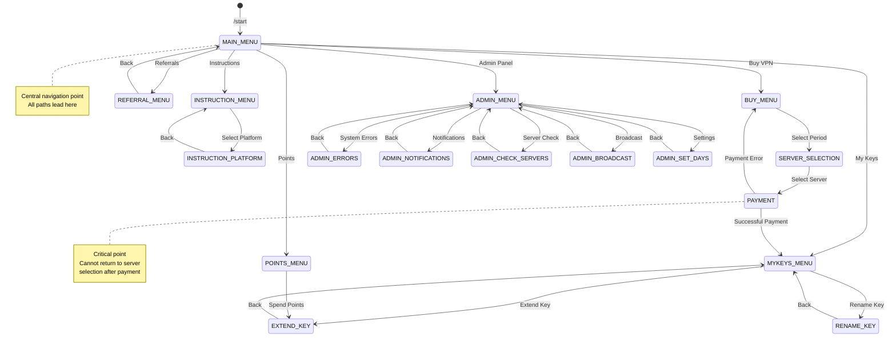

<div align="center">

# Daralla VPN Bot

**Enterprise-grade Telegram bot for VPN service management with referral system**

[](https://python.org)
[](https://core.telegram.org/bots/api)
[](https://docker.com)
[](LICENSE)

*Secure • Fast • Reliable*

</div>

---

## Overview

Daralla VPN Bot is a professional Telegram bot solution for managing VPN services with integrated payment processing, referral system, and multi-server support. Built with modern Python technologies and designed for enterprise deployment.

### Key Features

**Security & Compliance**
- YooKassa payment integration with webhook verification
- Comprehensive input validation and data sanitization
- Detailed audit logging for all operations
- Secure database transactions with rollback support

**Multi-Server Architecture**
- Support for 6+ VPN servers across multiple regions
- X-UI API integration for automated key management
- Automatic server load balancing and failover
- Real-time server monitoring and health checks

**Monetization & Business Logic**
- Advanced referral system with point-based rewards
- Flexible subscription tiers (1 day to 1 year)
- Automated payment processing via YooKassa
- Comprehensive analytics and reporting

**Technical Excellence**
- Asynchronous architecture using aiosqlite and python-telegram-bot
- Docker containerization for easy deployment and scaling
- GitHub Actions CI/CD with automated data backup
- SQLite database with optimized indexes and transactions

---

## System Architecture



## Navigation Structure



### User Interaction Flows



### State Machine



### Navigation States

| State | Description | Available Actions | Restrictions |
|-------|-------------|-------------------|--------------|
| **MAIN_MENU** | Main menu | All core functions | Entry point for all users |
| **INSTRUCTION_MENU** | Instructions menu | Platform selection | Read-only |
| **INSTRUCTION_PLATFORM** | Platform instruction | Back to instructions | Static content |
| **BUY_MENU** | VPN purchase | Period selection | Requires server configuration |
| **SERVER_SELECTION** | Server selection | Server choice, payment | Cannot return after payment |
| **PAYMENT** | Payment process | Payment waiting | Critical point |
| **MYKEYS_MENU** | My keys | Key management | Requires active keys |
| **EXTEND_KEY** | Key extension | Extend with money/points | Requires key selection |
| **RENAME_KEY** | Key renaming | Name change | Requires key selection |
| **POINTS_MENU** | Points | Balance view, spending | Requires accumulated points |
| **REFERRAL_MENU** | Referrals | Statistics, link | Available to all users |
| **ADMIN_MENU** | Admin panel | System management | Administrators only |
| **ADMIN_ERRORS** | System errors | Log viewing | Administrators only |
| **ADMIN_NOTIFICATIONS** | Notifications | Notification management | Administrators only |
| **ADMIN_CHECK_SERVERS** | Server check | Server monitoring | Administrators only |
| **ADMIN_BROADCAST** | Broadcast | Mass notifications | Administrators only |
| **ADMIN_SET_DAYS** | Settings | System configuration | Administrators only |

---

## Quick Start

### Prerequisites

- **OS**: Ubuntu 20.04+ / Debian 11+
- **RAM**: Minimum 1GB
- **Docker**: 20.10+
- **Docker Compose**: 2.0+
- **Git**: 2.25+

### 1. Docker Installation

```bash
# Update system
sudo apt update && sudo apt upgrade -y

# Install Docker
curl -fsSL https://get.docker.com -o get-docker.sh
sudo sh get-docker.sh
sudo usermod -aG docker $USER

# Install Docker Compose
sudo curl -L "https://github.com/docker/compose/releases/latest/download/docker-compose-$(uname -s)-$(uname -m)" -o /usr/local/bin/docker-compose
sudo chmod +x /usr/local/bin/docker-compose

# Reboot
sudo reboot
```

### 2. Project Setup

```bash
git clone https://github.com/thesemeiev/Daralla.git
cd Daralla
```

### 3. Environment Configuration

```bash
# Copy configuration template
cp env.example .env

# Edit configuration
nano .env
```

**Required parameters:**
```env
# Telegram Bot
TELEGRAM_TOKEN=your_bot_token_here
ADMIN_ID=your_telegram_id

# YooKassa
YOOKASSA_SHOP_ID=your_shop_id
YOOKASSA_SECRET_KEY=your_secret_key

# X-UI Servers (minimum one)
XUI_HOST_FINLAND_1=your_server_ip
XUI_LOGIN_FINLAND_1=your_login
XUI_PASSWORD_FINLAND_1=your_password
```

### 4. Bot Launch

```bash
# Start bot
docker-compose up -d

# Check status
docker-compose ps
```

---

## Management

### Basic Commands

```bash
# View logs
docker-compose logs -f

# Stop bot
docker-compose down

# Restart bot
docker-compose restart

# Update bot
git pull && docker-compose up -d --build

# Check status
docker-compose ps
```

### Backup & Recovery

Бэкапы: CI (`.github/workflows/backup.yml`) и скрипт `backup.sh`.

```bash
# Restore from backup
tar -xzf backup_*.tar.gz -C ./
```

---

## Monitoring

### Logs
```bash
# All logs
docker-compose logs -f

# Errors only
docker-compose logs -f | grep ERROR

# Last 100 lines
docker-compose logs --tail=100
```

### Statistics
```bash
# Resource usage
docker stats daralla-bot

# Database size
du -sh data/*.db
```

---

## Token Configuration

### Telegram Bot Token
1. Contact [@BotFather](https://t.me/BotFather) in Telegram
2. Send `/newbot`
3. Create bot name and username
4. Copy the provided token

### Telegram ID
1. Contact [@userinfobot](https://t.me/userinfobot) in Telegram
2. Copy your user ID

### YooKassa
1. Register at [yookassa.ru](https://yookassa.ru)
2. Create a store
3. Obtain Shop ID and Secret Key

---

## Development

### Project Structure

```
Daralla/
├── bot/                    # Core bot code
│   ├── bot.py             # Main bot file
│   ├── keys_db.py         # Database operations
│   ├── navigation.py      # Navigation system
│   └── menu_states.py     # State definitions
├── .github/workflows/     # GitHub Actions
├── data/                  # Database files
├── docker-compose.yml     # Docker configuration
├── Dockerfile            # Docker image
└── requirements.txt      # Python dependencies
```

### Local Development

```bash
# Install dependencies
pip install -r requirements.txt

# Run in development mode
python -m bot.bot
```

---

## Performance

### Recommended Server Specifications

| Users | CPU | RAM | Disk | Network |
|-------|-----|-----|------|---------|
| 100-500     | 1 vCPU | 1GB | 10GB | 100 Mbps |
| 500-2000    | 2 vCPU | 2GB | 20GB | 1 Gbps |
| 2000+       | 4 vCPU | 4GB | 50GB | 1 Gbps |

### Optimization Features

- **Database Indexes** - Automatically created on startup
- **Log Rotation** - Automatic log cleanup
- **Caching** - Built-in query caching
- **Monitoring** - Performance tracking

---

## Security

### Recommendations

1. **Regular Updates** - Keep Docker images updated
2. **Strong Passwords** - Use secure passwords for X-UI servers
3. **Access Control** - Restrict SSH access to server
4. **Firewall** - Configure firewall for port protection
5. **Log Monitoring** - Monitor logs for suspicious activity

### Security Audit

```bash
# Check Docker image vulnerabilities
docker scout cves daralla-telegram-bot

# Analyze security logs
docker-compose logs | grep -i "security\|error\|fail"
```

---

## Support

### Documentation
- [Telegram Bot API](https://core.telegram.org/bots/api)
- [YooKassa API](https://yookassa.ru/developers/api)
- [X-UI Documentation](https://github.com/vaxilu/x-ui)

### Community
- [GitHub Issues](https://github.com/thesemeiev/Daralla/issues)
- [Telegram Support](https://t.me/your_support_channel)

---

## License

This project is licensed under the MIT License. See the [LICENSE](LICENSE) file for details.

---

## Acknowledgments

- [python-telegram-bot](https://github.com/python-telegram-bot/python-telegram-bot) - Telegram Bot API
- [YooKassa](https://yookassa.ru) - Payment system
- [X-UI](https://github.com/vaxilu/x-ui) - VPN management panel

---

<div align="center">

**Built with precision for secure internet access**

[⭐ Star this project](https://github.com/thesemeiev/Daralla) • [🐛 Report bug](https://github.com/thesemeiev/Daralla/issues) • [💡 Suggest improvement](https://github.com/thesemeiev/Daralla/issues)

</div>